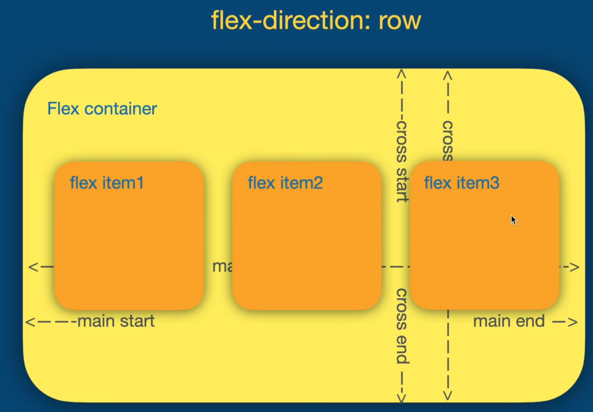
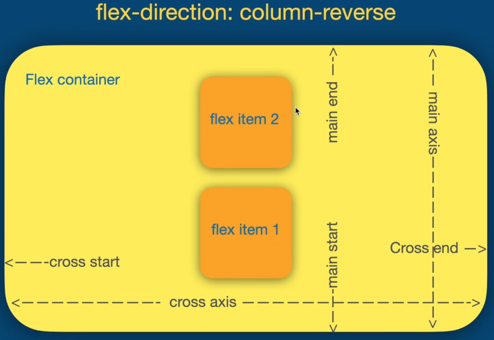

## CSS flex
```css
display:flex 
```

### `flex-direction`
```css
 flex-direction:row
```

```css
 flex-direction:row-reverse
```

```css
 flex-direction:column
```

```css
 flex-direction:column-reverse
```

## `flex-basis`&`flex-grow`
```css
.container{
    display:flex;
    width:500px;
}
.item{
    flex-basis:50px;
    /*flex-basis represents the width of the flex element
    if it is set to auto, it's the same as min-content, which equals to the length of the longest word in the text.
    you can also use width instead of flex-basis*/
    flex-grow:1;
}
.item:nth-child(1){
    flex-grow:6
}
/* 4(50+x)+50+6x=500 */
/*you can set flex-basis to 0 to make the width of the first child 6 times the others.*/
```